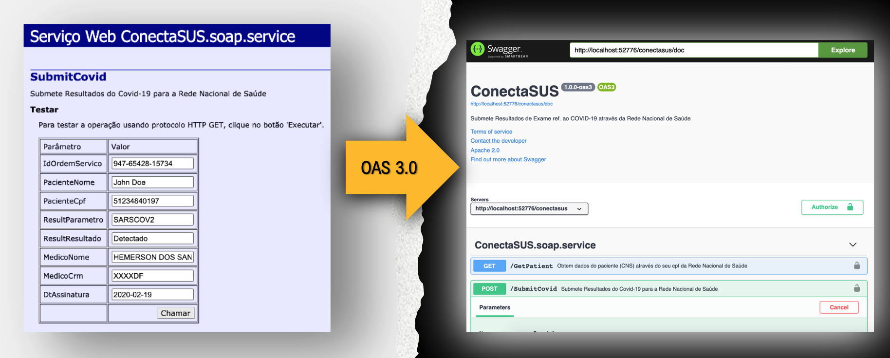
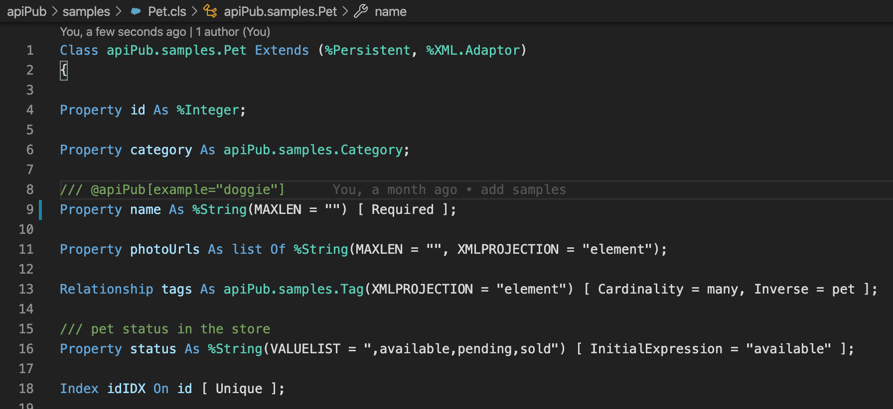
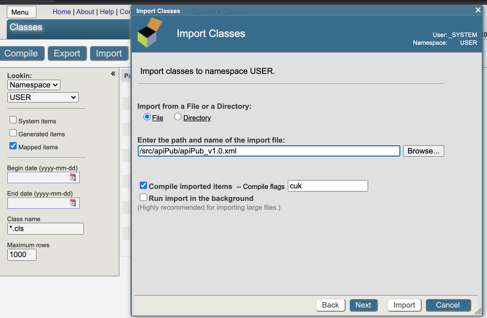
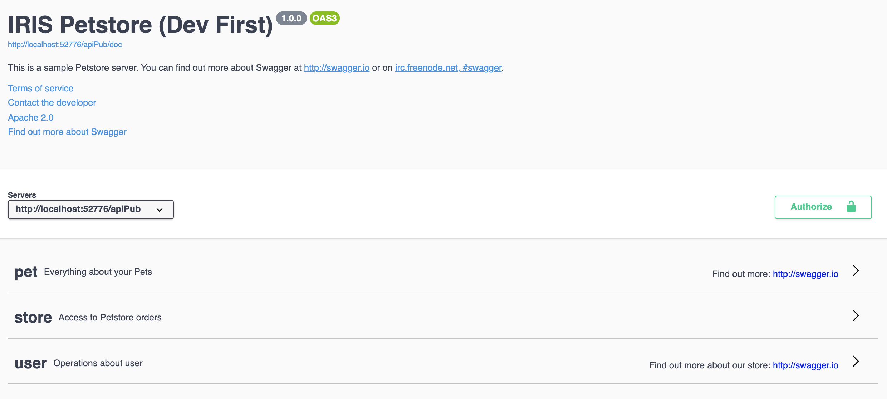

## Introduction

We are in the **multi-platform economy** era, and API's are the “glue” of this digital landscape. Being so important, they are seen by developers as a **service** or **product** to be consumed. Therefore, the **experience** in its use is a crucial success factor.

In order to **improve this experience**, specification standards, such as the [Open API Specification (OAS)](https://swagger.io/specification/) are increasingly being adopted in the RESTFul API’s development.

# What IRIS apiPub is for?

This personal [open source](https://en.wikipedia.org/wiki/Open_source) project has the main intention to automatically **publish RESTful API's** built with [Intersystems IRIS technology](https://www.intersystems.com/try-intersystems-iris-for-free/), in the simplest and fastest way possible, using the [Open API Specification](https://swagger.io/specification/) (OAS 3.0) standard.

It allows the user to focus mainly on the **implementation** and business rules of API’s (Web Methods), abstracting and automating other aspects related to **documentation, exposure, dispatching and monitoring** of services.

This project also includes a full IRIS sample class ([apiPub.samples.api](/samples/api.cls)), based on the official [Swagger Petstore sample](https://app.swaggerhub.com/apis/Colon-Org/Swagger-PetStore-3.0/1.1).


## Test with your existing SOAP services
If you already have any SOAP services published, you can try this tool with the same code.


When publishing methods with complex types, the object class must be a subclass of %XML.Adaptor. This way, SOAP services already built automatically become compatible.



## Monitor your APIs with IRIS Analytics
Enable API monitoring to **manage** and **track** all *rest service calls*. Also build your own indicators.


## **How to install**

Import the [apiPub_vx.xml](https://raw.githubusercontent.com/devecchijr/apiPub/base/apiPub_v1.1.xml) package into the target namespace via terminal.

```
zn "USER"
Do $System.OBJ.Load("/path/apiPub_vx.xml","ck")
```
Or through the administration portal


## **Publish your OAS 3.0 API in just 3 steps:**

## Step 1  
Define your API’s implementation class and **label** your methods with the [WebMethod] attribute

*If you already have a Web Method in place, you can try it.*

## Step 2
Create a **subclass** of apiPub.core.service and point the DispatchClass property to your Implementation class (Step 1). Also inform the OAS 3.0 documentation path. You can also point to the existent apiPub.samples.api class (PetStore sample).


## Step 3
Create a Web Application and point the Dispatch class to the service class created previously (Step 2).


## Use the Swagger
With the [iris-web-swagger-ui](https://openexchange.intersystems.com/package/iris-web-swagger-ui) tool is possible to expose your service specifications. Just point to the documentation path and ... **VOILÁ!!**


## Define the OAS header


There are two ways to set the OAS 3.0 header: 

The first is by creating a XDATA JSON block named as *apiPub* in the implementation class. This method allows having more than one Tag (group) and the modeling is compatible with the OAS 3.0 standard. The properties allowed for customization are *info, tags and servers*.
```
XData apiPub [ MimeType = application/json ]
{
    {
        "info" : {
            "description" : "This is a sample Petstore server.  You can find\nout more about Swagger at\n[http://swagger.io](http://swagger.io) or on\n[irc.freenode.net, #swagger](http://swagger.io/irc/).\n",
            "version" : "1.0.0",
            "title" : "IRIS Petstore (Dev First)",
            "termsOfService" : "http://swagger.io/terms/",
            "contact" : {
            "email" : "apiteam@swagger.io"
            },
            "license" : {
            "name" : "Apache 2.0",
            "url" : "http://www.apache.org/licenses/LICENSE-2.0.html"
            }
        },
        "tags" : [ {
            "name" : "pet",
            "description" : "Everything about your Pets",
            "externalDocs" : {
            "description" : "Find out more",
            "url" : "http://swagger.io"
            }
        }, {
            "name" : "store",
            "description" : "Access to Petstore orders"
        }, {
            "name" : "user",
            "description" : "Operations about user",
            "externalDocs" : {
            "description" : "Find out more about our store",
            "url" : "http://swagger.io"
            }
        } ]
    }
}
```
The second way is through the definition of parameters in the implementation class, as in the following example:

```
Parameter SERVICENAME = "My Service";

Parameter SERVICEURL = "http://localhost:52776/apipub";

Parameter TITLE As %String = "REST to SOAP APIs";

Parameter DESCRIPTION As %String = "APIs to Proxy SOAP Web Services via REST";

Parameter TERMSOFSERVICE As %String = "http://www.intersystems.com/terms-of-service/";

Parameter CONTACTNAME As %String = "John Doe";

Parameter CONTACTURL As %String = "https://www.intersystems.com/who-we-are/contact-us/";

Parameter CONTACTEMAIL As %String = "support@intersystems.com";

Parameter LICENSENAME As %String = "Copyright InterSystems Corporation, all rights reserved.";

Parameter LICENSEURL As %String = "http://docs.intersystems.com/latest/csp/docbook/copyright.pdf";

Parameter VERSION As %String = "1.0.0";

Parameter TAGNAME As %String = "Services";

Parameter TAGDESCRIPTION As %String = "Legacy Services";

Parameter TAGDOCSDESCRIPTION As %String = "Find out more";

Parameter TAGDOCSURL As %String = "http://intersystems.com";
```
## Customize your API


It is possible to customize various aspects of the API's, such as tags, paths and verbs. For this, it is necessary to use a specific notation, defined in the comment of the method to be customized. 

Syntax:
>***/// @apiPub[assignment clause]***  
[*Method/ClassMethod*] *methodName(params as type) As returnType* {  
>    
>}

All customizations given as an example in this documentation are available in the [apiPub.samples.api](/samples/api.cls) class.

## Customizing HTTP Verbs
When there is no complex type as an input parameter in your method, apiPub automatically sets the verb as *Get*. Otherwise, the verb *Post* is set.

If you want to customize the method, add the following line to the method comments.

>/// @apiPub[verb="*verb*"]

Where *verb* can be **get, post, put, delete ou patch**. 

Example:

>/// @apiPub[verb="put"]

## Customizing Paths
This tool automatically sets paths or routing based on the *method name*.

If you want to customize the **path**, add the following line in the method comments.

>/// @apiPub[path="*path*"]

Where *path* can be any value preceded by a slash, as long as it does not conflict with another *path* in the same implementation class.

Example:
>/// @apiPub[path="/pet"]

Another very common use is to define one or more parameters in the path itself. To do this, it is necessary that the name of the parameter defined in the method is enclosed in curly braces.

Example:
>/// @apiPub[path="/pet/{petId}"]  
Method getPetById(petId As %Integer) As apiPub.samples.Pet [ WebMethod ]   
{  
}

When internal (method) parameter name differs from the exposed parameter, they can be equalized according to the following example:
>/// @apiPub[path="/pet/{petId}"]  
/// @apiPub[params.pId.name="petId"]  
Method getPetById(pId As %Integer) As apiPub.samples.Pet [ WebMethod ]   
{  
}

In the example above, the internal parameter *pId* is exposed as *petId*.

## Customizing the Tags

It is possible to define the method **tag** (group) when there is more than one *tag* defined in the header
>/// @apiPub[tag="*value*"]

Example:
>/// @apiPub[tag="user"]

## Customizing The Successful Code

If you want to change the *Status Code* of success, which is by default ***200***, the following notation is used.
>/// @apiPub[successfulCode="*code*"]

Example:
>/// @apiPub[successfulCode="201"]

## Customizing Exception Codes
This tool defaults to the **Status Code 500** for any exceptions. If you want to add new codes for exception in the documentation, the following notation is used.
>/// @apiPub[statusCodes=[{code:"*code*",description:"*description*"}]]

Where the *statusCodes* property is an object array with *code* and *description*. 

Example:
> /// @apiPub[statusCodes=[  
    ///     {"code":"400","description":"Invalid ID supplied"}  
    ///     ,{"code":"404","description":"Pet not found"}]  
    /// ]

When throwing the exception, include the *Status Code* in the exception description between the "<" and ">" signs.

Example:
> Throw ##Class(%Exception.StatusException).CreateFromStatus($$$ERROR($$$GeneralError, "***<400>*** Invalid ID supplied"))}

See the ***getPetById*** method of the [apiPub.samples.api](/samples/api.cls) class.

## Setting the API as deprecated

To expose the API as ***deprecated***, the following notation is used:

>/// @apiPub[deprecated="true"]

## Customizing the *operationId*

According to the  OAS, ***operationId*** is a unique string used to identify an API or operation. In this tool it is used for the same purpose in [monitoring and tracking](https://github.com/devecchijr/apiPub#monitor-your-apis-with-iris-analytics) operations.

By default, the *method name* is used.

If you want to change it, use the following notation:

>/// @apiPub[operationId="updatePetWithForm"]

## Changing the charset

The default *CHARSET* for rest services is defined in the service class (%CSP.Rest), described in [Step 2](https://github.com/devecchijr/apiPub#step-2). If you want to change it for a method, the following notation must be used:

>/// @apiPub[charset="*value*"]

Example:

>/// @apiPub[charset="UTF-8"]

## Customizing parameter names and other parameters functionality
It's possible to customize various aspects of each input and output method parameter, such as the names and descriptions that will be exposed.

To customize a specific method parameter, use the following notation:

>/// @apiPub[params.*paramId.property*="*value*"]

Or for responses:

>/// @apiPub[response.*property*="*value*"]

Example:
>/// @apiPub[params.pId.name="petId"]  
/// @apiPub[params.pId.description="ID of pet to return"]

In this case, the external name *petId* and the *ID of pet to return* description are being assigned to the *pId* method parameter.

When customization is not specific to a given parameter, but to the entire request, the following notation is used:
>/// @apiPub[params.*property*="*value*"]

In the example below, the *This can only be done by the logged in user* description is assigned to the entire *request*, not just a parameter:
  
>/// @apiPub[params.description="This can only be done by the logged in user."]

## Other Properties that can be customized for specific method parameters

Use the following notation for input or output method parameters:
>/// @apiPub[params.*paramId.property*="*value*"]

For responses:
>/// @apiPub[response.*property*="*value*"]

|   Property           |   Description                                                                                                                                                                                                                                                                                                                                        |
|----------------------|------------------------------------------------------------------------------------------------------------------------------------------------------------------------------------------------------------------------------------------------------------------------------------------------------------------------------------------------------|
|   required           |   "true" if the parameter is required. All **path** parameters are already automatically required.                                                                                                                                                                                                                                        |
|   schema.items.enum  |   display of enumerators for %String or %Library.DynamicArray param types. See the **findByStatus** method of the [apiPub.samples.api](/samples/api.cls) class.                                                                                                                                                                                  |
|   schema.default     |   default value for enumerators.                                                                                                                                                                                                                                                                                                    |
|   inputType          |   By default it is **query parameter** for simple types and **application/json** for complex types (body). If you want to change input type, you can use this parameter. Usage example: Uploading an image, which is not normally of the JSON type. See ***uploadImage*** method of the [apiPub.samples.api](/samples/api.cls) class.    |
|   outputType         |   By default it is **header** for the %Status and **application/json** type for the rest. If you want to change the output type, you can use this parameter. Usage example: Returning a "text / plain" token.  See ***loginUser*** method of the [apiPub.samples.api](/samples/api.cls) class.                                                   |

## Relate Parseable Schemas to Dynamic JSON Types ***(%Library.DynamicObject)***

It is possible to relate [OAS 3.0 schemas](https://swagger.io/docs/specification/data-models/) to internal [dynamic types](https://docs.intersystems.com/hs20201/csp/docbook/DocBook.UI.Page.cls?KEY=GJSON_create).

The advantage of this, in addition to informing the user of the required object ***specification***, is the ***automatic parsing*** of the request payload in the API call. If an API user for example submits a property that is not in the schema, sends a date in an invalid format or does not send a mandatory property, one or more errors will be returned to the user informing the irregularities.

The first step is to include the desired schema in the XDATA block as shown below. In this case the schema called **User** can be used by any method. It must follow the same rules as [OAS 3.0](https://swagger.io/docs/specification/data-models/) modeling.

```
XData apiPub [ MimeType = application/json ]
{
    {
        "schemas": {
            "User": {
                "type": "object",
                "required": [
                    "id"
                ],
                "properties": {
                    "id": {
                        "type": "integer",
                        "format": "int64"
                    },
                    "username": {
                        "type": "string"
                    },
                    "firstName": {
                        "type": "string"
                    },
                    "lastName": {
                        "type": "string"
                    },
                    "email": {
                        "type": "string"
                    },
                    "password": {
                        "type": "string"
                    },
                    "phone": {
                        "type": "string"
                    },
                    "userStatus": {
                        "type": "integer",
                        "description": "(short) User Status"
                    }
                }
            }            
        }
    }
}
```
The second step is to relate the name of the schema informed in the previous step to the internal method parameter of type [%Library.DynamicObject](https://docs.intersystems.com/hs20201/csp/docbook/DocBook.UI.Page.cls?KEY=GJSON_create) using the following notation:

>/// @apiPub[params.*paramId*.*schema*="*schema name*"]

Example relating the *user* method parameter to the *User* schema:
```
/// @apiPub[params.user.schema="User"]
Method updateUserUsingOASSchema(username As %String, user As %Library.DynamicObject) As %Status [ WebMethod ]
{
    code...
}
```
Request example with error to be submitted. The *username2* property does not exist in the *User* schema. The id property is also not specified and is required:
```
{
  "username2": "devecchijr",
  "firstName": "claudio",
  "lastName": "devecchi junior",
  "email": "devecchijr@gmail.com",
  "password": "string",
  "phone": "string",
  "userStatus": 0
}
```

Example of Error returned:
```
{
  "statusCode": 0,
  "message": "ERRO #5001: <Bad Request> Path User.id is required; Invalid path: User.username2",
  "errorCode": 5001
}
```
See ***updateUserUsingOASSchema*** and ***getInventory*** methods of the [apiPub.samples.api](/samples/api.cls) class. The ***getInventory*** method is an example of a schema associated with the response method, so it is not parseable.

### Generate the OAS 3.0 schema based on a JSON instance

To facilitate the OAS schema generation, you can use the following feature:

**Set** your sample JSON object.
```
set myObject = {"prop1":"2020-10-15","prop2":true, "prop3":555.55, "prop4":["banana","orange","apple"]}
```

**Use the utility method** of the class [apiPub.core.publisher](/core/publisher.cls) to generate the schema:
```
do ##class(apiPub.core.publisher).TemplateToOpenApiSchema(myObject,"objectName",.schema)
```
**Copy and paste** the response schema in the XDATA block:

Example:

```
XData apiPub [ MimeType = application/json ]
{
    {
        "schemas": {
            {
                "objectName":   
                {
                    "type":"object",
                    "properties":{
                        "prop1":{
                            "type":"string",
                            "format":"date",
                            "example":"2020-10-15"      
                        },
                        "prop2":{
                            "type":"boolean",
                            "example":true
                        },
                        "prop3":{
                            "type":"number",
                            "example":555.55
                        },
                        "prop4":{
                            "type":"array",
                            "items":{
                                "type":"string",
                                "example":"apple"
                            }
                        }
                    }
                }
            }
        }
    }
}
```


## Enable Monitoring *(Optional)*

1 - Add and activate the following components in your *Production* (*IRIS Interoperability*)

|   Component          |    Type           |  
|----------------------|-------------------|  
|  apiPub.tracer.bm    |  Service (BS)     |
|  apiPub.tracer.bs    |  Service (BS)     |
|  apiPub.tracer.bo    |  Operation (BO)   |

2 - Enable monitoring in the class described in [Step 2](https://github.com/devecchijr/apiPub#step-2)

The ***Traceable*** parameter must be enabled.
```
Parameter Traceable As %Boolean = 1;

Parameter TracerBSName = "apiPub.tracer.bs";

Parameter APIDomain = "samples";
```
The ***APIDomain*** parameter is used to determine the API group for monitoring (specific dimension).

3 - Import the sample dashboard (***[apiPub_Analytics_vx.xml](https://raw.githubusercontent.com/devecchijr/apiPub/base/apiPub_Analytics_v1.0.xml)***) in the administration portal (*Analytics/Admin/Folder Manager* option). Other dashboards can also be created based on the apiPub Monitor cube.

## Use this tool in conjunction with the Intersystems API Manager
Route your generated APIs and get several benefits with the [Intersystems API Manager](https://docs.intersystems.com/irislatest/csp/docbook/DocBook.UI.Page.cls?KEY=AFL_IAM).

## Compatibility

[ApiPub](https://github.com/devecchijr/apiPub#iris-apipub) is compatible with [Intersystems IRIS](https://www.intersystems.com/products/intersystems-iris/) or [Intersystems IRIS for Health](https://www.intersystems.com/products/intersystems-iris-for-health/) products from version 2018.1.

## Supported primitive types for method params 

|   Primitive Type           |   OAS JSON Type           |   OAS Format Type  |
|----------------------------|---------------------------|--------------------|
|   %Binary                  |   string                  |                    |
|   %xsd.base64Binary        |   string                  |                    |
|   %Boolean                 |   boolean                 |                    |
|   %Date                    |   string                  |   date             |
|   %PosixTime               |   string                  |   date-time        |
|   %StringTimeStamp         |   string                  |   date-time        |
|   %TimeStamp               |   string                  |   date-time        |
|   %DateTime                |   string                  |   date-time        |
|   %Currency                |   number                  |                    |
|   %Float                   |   number                  |                    |
|   %Decimal                 |   number                  |                    |
|   %Numeric                 |   number                  |                    |
|   %Double                  |   number                  |                    |
|   %Float                   |   number                  |                    |
|   %BigInt                  |   integer                 |   int64            |
|   %xsd.int                 |   integer                 |                    |
|   %xsd.long                |   integer                 |   int64            |
|   %Integer                 |   integer                 |                    |
|   %SmallInt                |   integer                 |   int32            |
|   %Time                    |   string                  |                    |
|   %TinyInt                 |   integer                 |                    |
|   %xsd.byte                |   integer                 |   int32            |
|   %String                  |   string                  |                    |
|   %Stream.FileBinary       |   string                  |   binary           |
|   %Stream.Filecharacter    |   string                  |                    |
|   %Stream.GlobalBinary     |   string                  |   binary           |
|   %Stream.GlobalCharacter  |   string                  |                    |
|   %Status                  |   special type as output  |                    |

## Supported property types for complex type params (object)

|   Property Type             |   OAS JSON Type                   |   OAS Format Type  |
|-----------------------------|-----------------------------------|--------------------|
|   %BigInt                   |   integer                         |   int64            |
|   %Binary                   |   string                          |                    |
|   %Boolean                  |   boolean                         |                    |
|   %Char                     |   string                          |                    |
|   %Counter                  |   integer                         |   int64            |
|   %Currency                 |   number                          |                    |
|   %Date                     |   string                          |   date             |
|   %DateTime                 |   string                          |   date-time        |
|   %Decimal                  |   number                          |                    |
|   %Double                   |   number                          |                    |
|   %EnumString               |   string                          |                    |
|   %ExactString              |   string                          |                    |
|   %Integer                  |   integer                         |   int64            |
|   %List                     |   array                           |                    |
|   %ListOfBinary             |   array                           |                    |
|   %Name                     |   string                          |                    |
|   %Numeric                  |   number                          |                    |
|   %SmallInt                 |   integer                         |                    |
|   %Status                   |   string                          |   binary           |
|   %String                   |   string                          |                    |
|   %Time                     |   string                          |                    |
|   %TimeStamp                |   string                          |   date-time        |
|   %TinyInt                  |   integer                         |                    |
|   %Stream.GlobalCharacter   |   string                          |                    |
|   %Stream.GlobalBinary      |   string                          |   binary           |
|   %Stream.GlobalCharacter   |   string                          |                    |
|   %Stream.GlobalBinary      |   string                          |   binary           |
|   Complex Type              |   object                          |                    |
|   list Of (Primitive Type)  |   array of (Primitive JSON Type)  |                    |
|   list Of (Complex Type)    |   array of (Complex Type)         |                    |
|   array Of (Primitive)	      |   array of (Primitive JSON Type)  |                    |
|   array Of (Complex Type)   |   array of (Complex Type)         |                    |
|   RelationShip              |   object or array                 |                    |

## Roadmap

|   Item                                                        |
|---------------------------------------------------------------|
|   ***Api First Approach (Introspection)*** - Read an OAS 3.0 specification file and create the Spec of the methods, just like in the class [apiPub.samples.apiFirst](/samples/apiFirst.cls) |